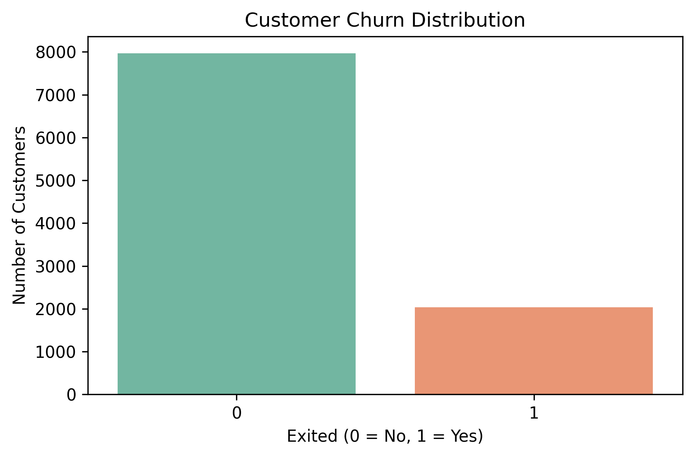
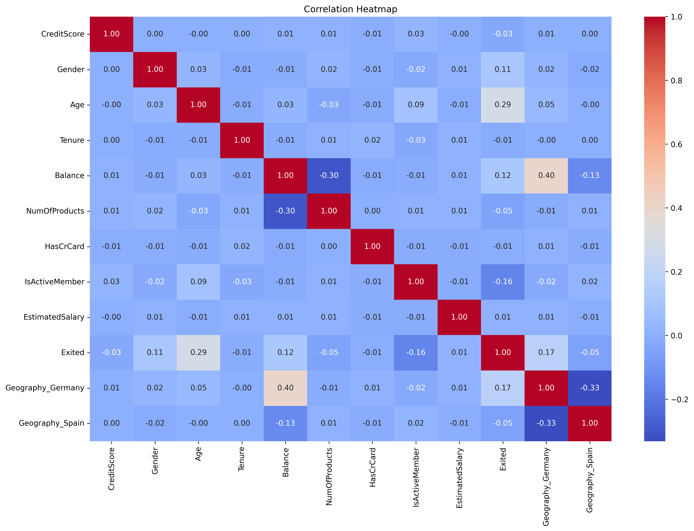
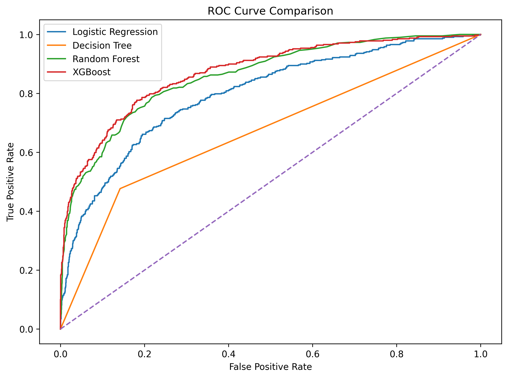
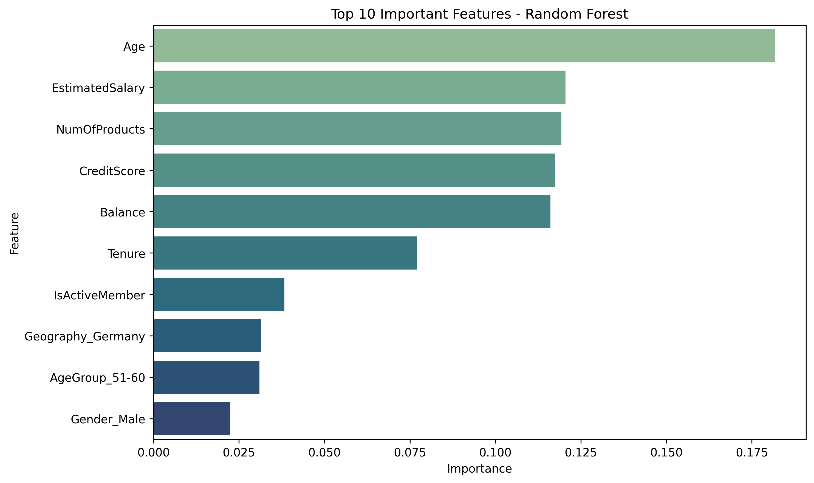
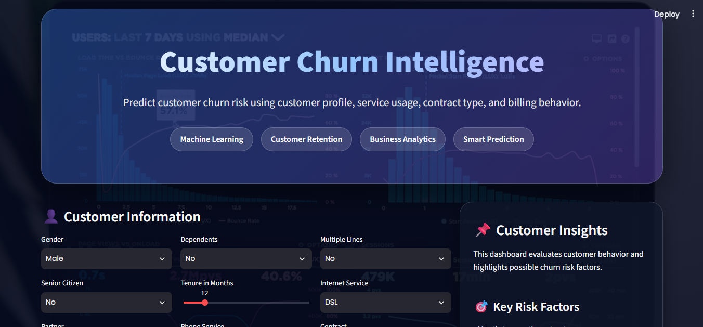

<div align="center">

# 🏦 Customer Churn Prediction using Machine Learning

### Predicting Customer Churn using Machine Learning and Data Analytics


</div>

---

# 📌 Overview

Customer churn is a critical business problem in the banking industry. This project develops an end-to-end machine learning pipeline capable of identifying customers who are likely to leave the bank.

The project covers the complete data science lifecycle:

- Data Cleaning
- Exploratory Data Analysis
- Feature Engineering
- Model Building
- Hyperparameter Tuning
- Model Evaluation
- Business Insights

---

# ⭐ Project Highlights

✔ Complete End-to-End Machine Learning Project

✔ Five Classification Models Compared

✔ Hyperparameter Tuning using GridSearchCV

✔ Feature Engineering

✔ SMOTE for Imbalanced Data

✔ Feature Importance Analysis

✔ Business Recommendations

✔ Production-ready Saved Model

---

# 🛠 Tech Stack

| Category | Tools / Libraries |
|---|---|
| Programming Language | Python |
| Data Handling | Pandas, NumPy |
| Data Visualization | Matplotlib, Seaborn |
| Machine Learning | Scikit-learn, XGBoost |
| Model Evaluation | Accuracy, Precision, Recall, F1 Score, ROC-AUC |
| Imbalance Handling | SMOTE |
| Model Saving | Joblib |

---

# 📂 Dataset

**Dataset:** Churn_Modelling.csv

Customers: **10,000**

Target Variable:

Exited

0 → Retained

1 → Churned

---

# 🔄 Project Workflow

```text
Dataset
   │
   ▼
Data Cleaning
   │
   ▼
EDA
   │
   ▼
Feature Engineering
   │
   ▼
Preprocessing
   │
   ▼
Model Training
   │
   ▼
Hyperparameter Tuning
   │
   ▼
Model Evaluation
   │
   ▼
Business Insights
```

---

# 📊 Exploratory Data Analysis

## Customer Churn Distribution



---

## Correlation Heatmap



---

# 🤖 Machine Learning Model Performance

| Model | Accuracy | Precision | Recall | F1 Score | ROC-AUC |
|---|---:|---:|---:|---:|---:|
| Logistic Regression | 83.25% | 71.95% | 28.99% | 41.33% | 79.65% |
| Decision Tree | 78.05% | 46.19% | 47.67% | 46.92% | 66.74% |
| Random Forest | 86.50% | 81.00% | 43.98% | 57.01% | 85.87% |
| **XGBoost** | **86.95%** | **79.67%** | 48.16% | 60.03% | **87.05%** |
| Tuned Random Forest | 83.70% | 58.56% | **68.06%** | **62.95%** | 86.39% |

---

# 🏆 Best Models

### XGBoost

Highest Accuracy

**86.95%**

Highest ROC-AUC

**87.05%**

---

### Tuned Random Forest

Highest Recall

**68.06%**

Highest F1 Score

**62.95%**

---

# 📈 ROC Curve



---

# ⭐ Feature Importance



Top Predictive Features:

- Age
- Estimated Salary
- Number of Products
- Credit Score
- Balance
- Tenure
- Active Membership
- Geography
- Age Group
- Gender

---

# 💡 Business Insights

✔ Older customers are more likely to churn.

✔ Active members have lower churn probability.

✔ Customers with multiple products are less likely to leave.

✔ Geography significantly influences customer churn.

✔ Churn prediction enables targeted retention campaigns.


---

# 📁 Repository Structure

```text
Customer-Churn-Prediction/
│
├── data/
├── images/
├── models/
├── notebooks/
├── processed_data/
├── src/
├── README.md
├── requirements.txt
├── LICENSE
└── .gitignore
```

---

# 🚀 Installation

```bash
git clone https://github.com/gopyka17-oss/Customer-Churn-Prediction.git
```

```bash
pip install -r requirements.txt
```

```bash
python src/customer_churn_prediction.py
```

---

# 🎯 Skills Demonstrated

- Data Cleaning
- Data Visualization
- Exploratory Data Analysis
- Feature Engineering
- Machine Learning
- Hyperparameter Tuning
- Model Evaluation
- Business Analytics
- Python Programming
- Predictive Analytics

---

# 🔮 Future Improvements

- Streamlit Dashboard
- SHAP Explainability
- Flask/FastAPI Deployment
- Docker
- Cloud Deployment

# 🌐 Interactive Web Application

This project also includes an interactive Streamlit dashboard.

Features:

- Customer churn prediction
- Churn probability score
- Risk level indicator
- Customer profile summary
- Personalized retention recommendations

Run locally:

```bash
streamlit run app.py
```

## 🌐 Streamlit Dashboard




---

# 👨‍💻 Author

## **Gopika P**

**MSc Data Science & Analytics**

Aspiring Data Analyst | Data Scientist

Python • SQL • R • Machine Learning • Data Analytics

---

⭐ If you found this project useful, please consider giving it a star.
